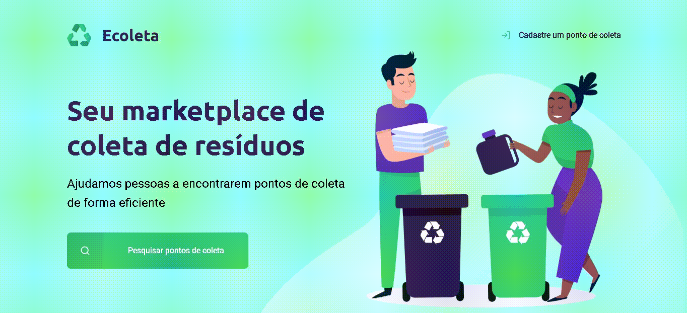

<h1 align="center">
    
</h1>

<h2 align="center">
    
</h2>

---

## 📋 Index

- [About](#-about)
- [Technologies](#-technologies)

---

## ♻ About

**Ecoleta** is a marketplace that helps people to find and register recycling points efficiently. The project is a **Full Stack application** (back-end and front-end) developed during the Next Level Week by RocketSeat.

---

## 🤖 Technologies

The project was developed using this technologies:

**Back-end:**
- [Node.js](https://nodejs.org/en/)
- [Express](https://expressjs.com/)
- [SQLite3](https://www.sqlite.org/version3.html)

**Front-end:**
- [HTML5](https://developer.mozilla.org/en-US/docs/Web/Guide/HTML/HTML5)
- [CSS3](https://developer.mozilla.org/en-US/docs/Archive/CSS3)
- [JavaScript](https://js.org/)
- [Nunjucks](https://mozilla.github.io/nunjucks/)

---

Developed with 💚 by Cássio Cappellari!